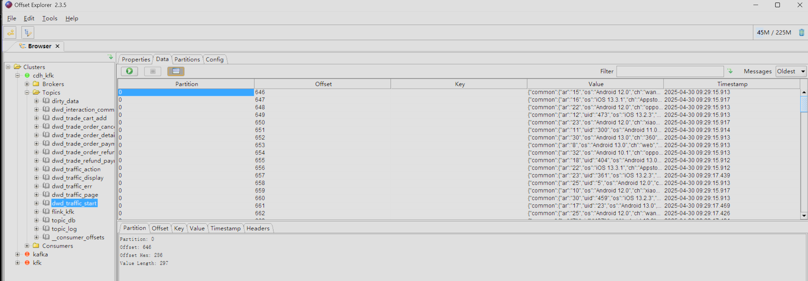
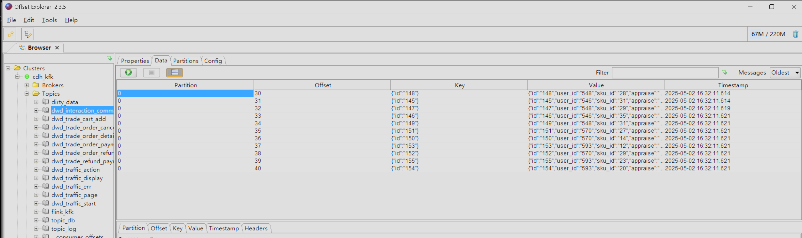
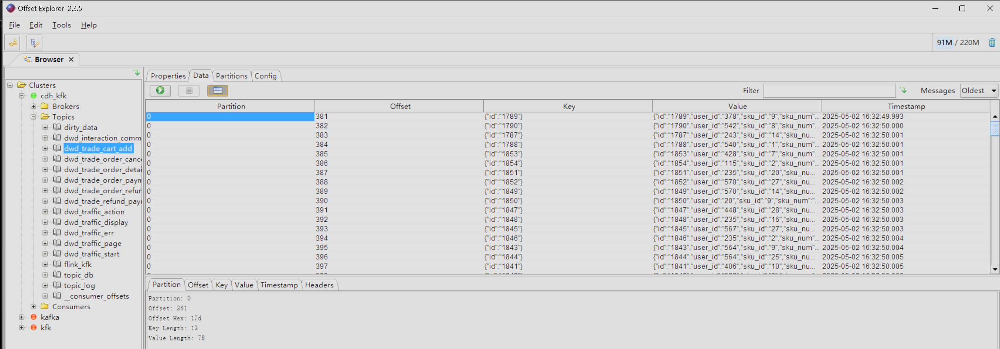
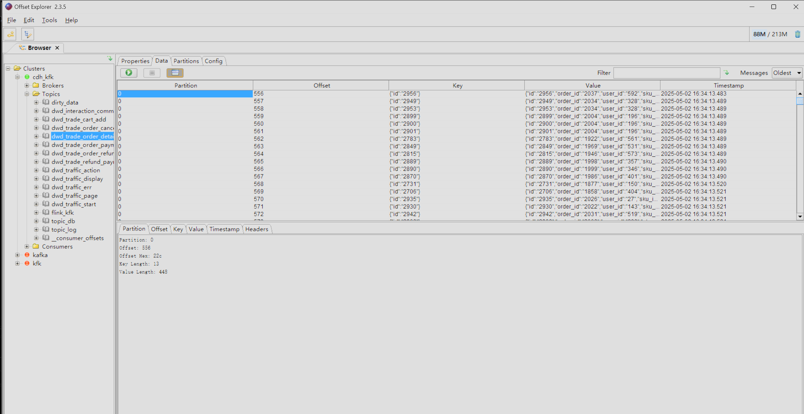
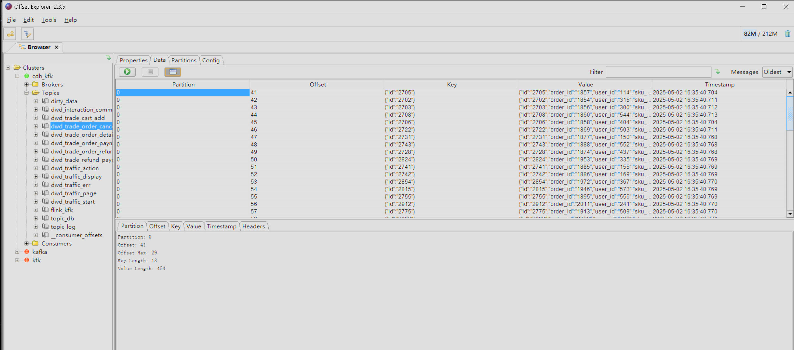
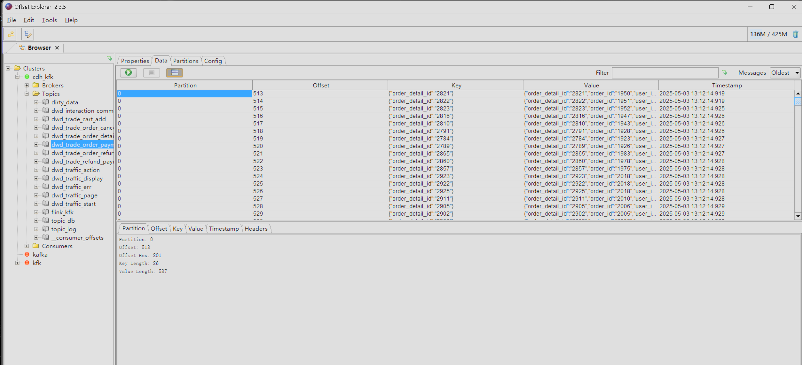
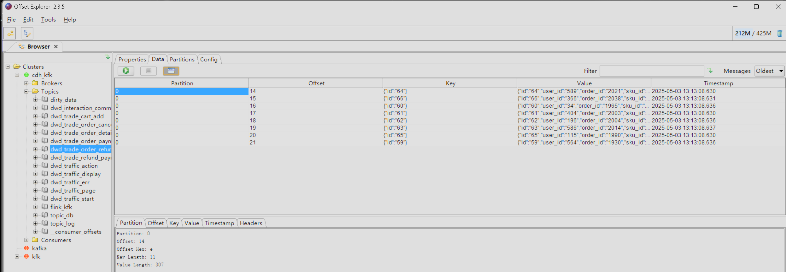
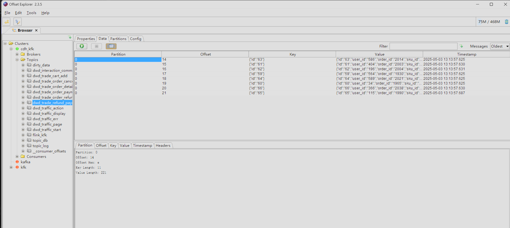

dwd层的DwdBaseDb修改

DwdBaseLog

DwdInteractionCommentInfo

dwd_trade_cart_add

dwd_trade_order_detail

dwd_trade_order_cancel

DwdTradeOrderPaySucDetail

dwd_trade_order_refund

dwd_trade_refund_payment_success

flink部署